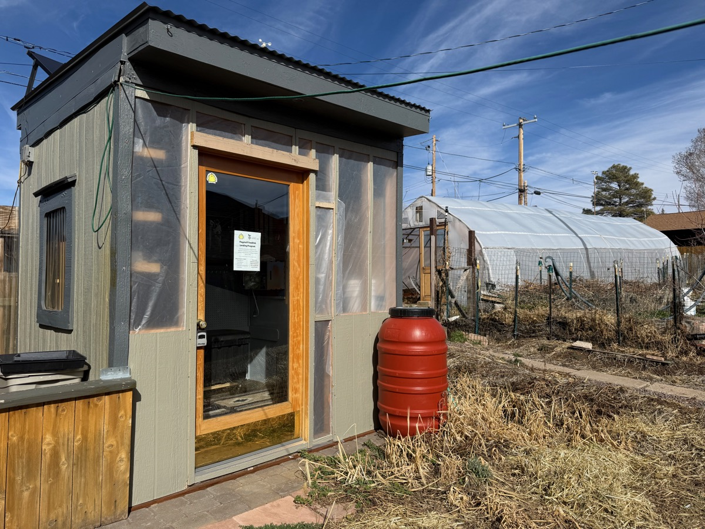
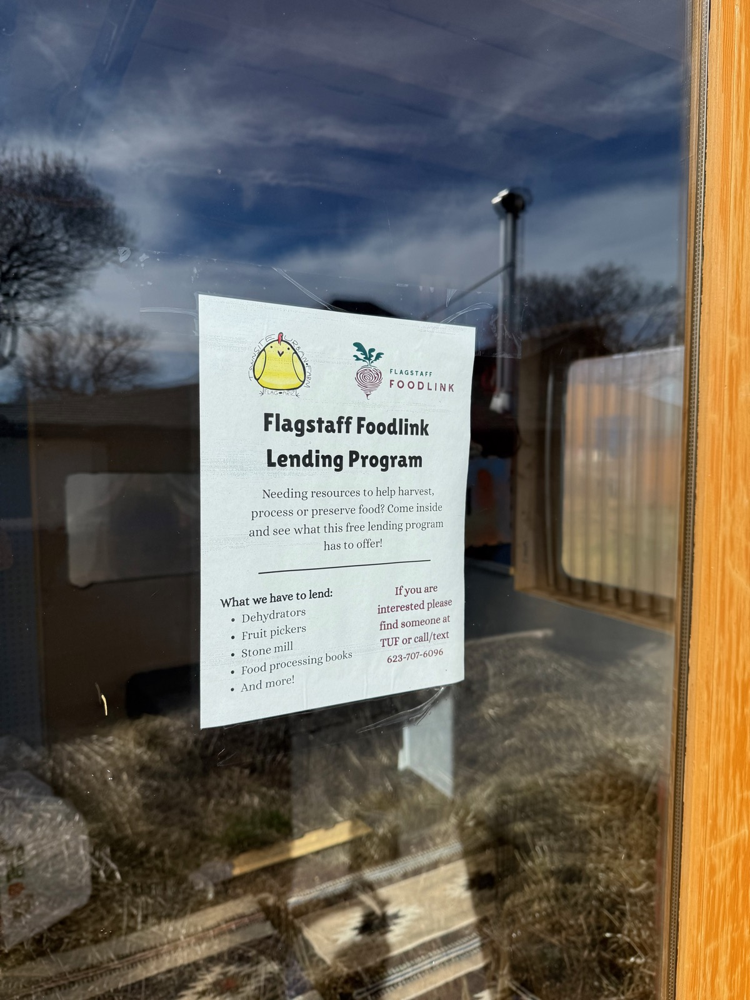
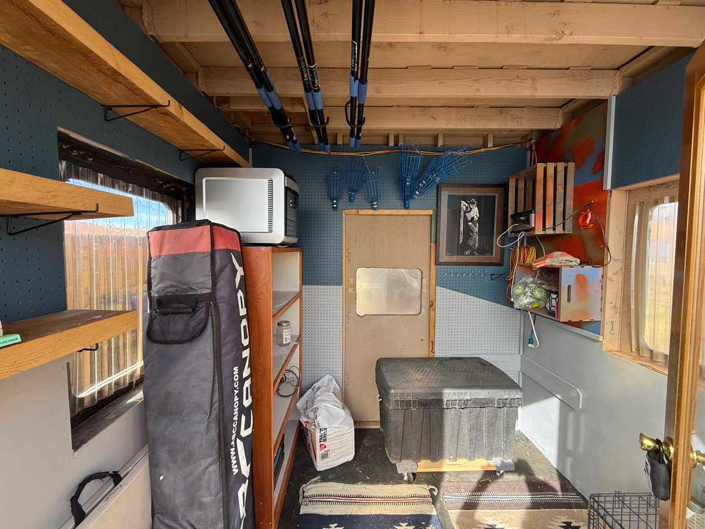
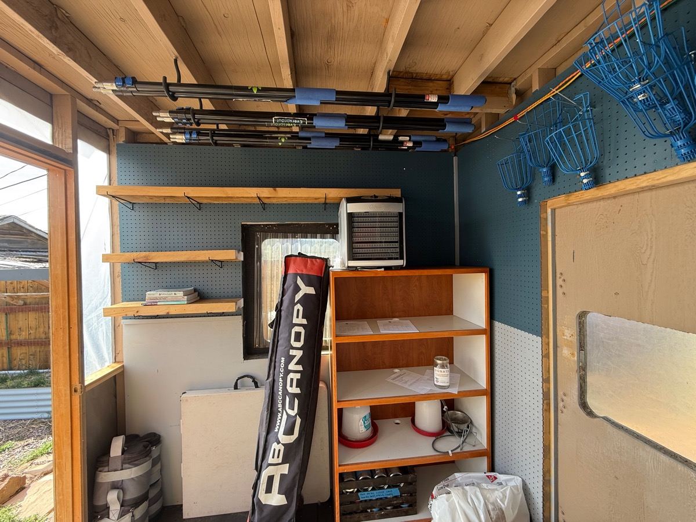
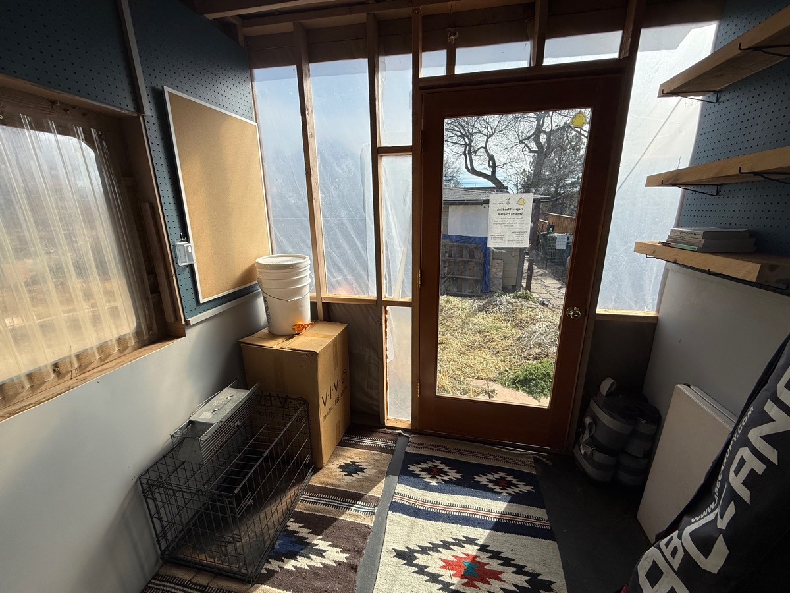

We're excited to share that Flagstaff Foodlink has launched a tool library based at TUF.

This project, supported in part by the City of Flagstaff Neighborhood Sustainability Grant to TUF, allows for community members to check out resources to help harvest, process or preserve food.

Tools currently include fruit pickers, dehydrators, seed starting heat maps and grow lights, and more.

For more information, reach out to info@townsiteuf.org.
