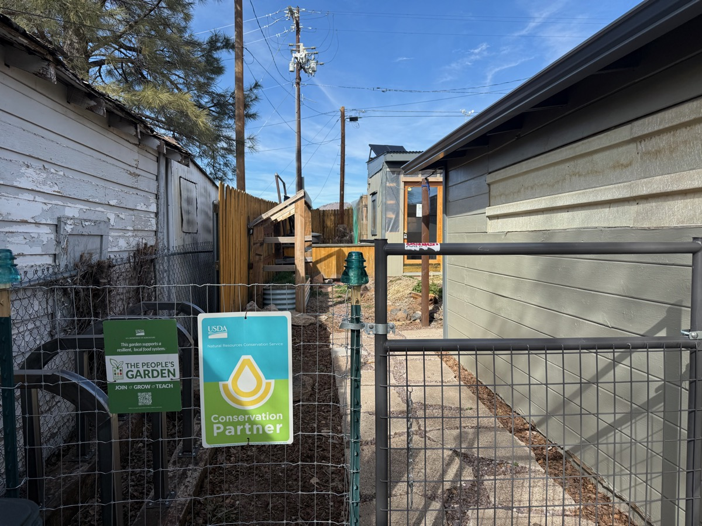
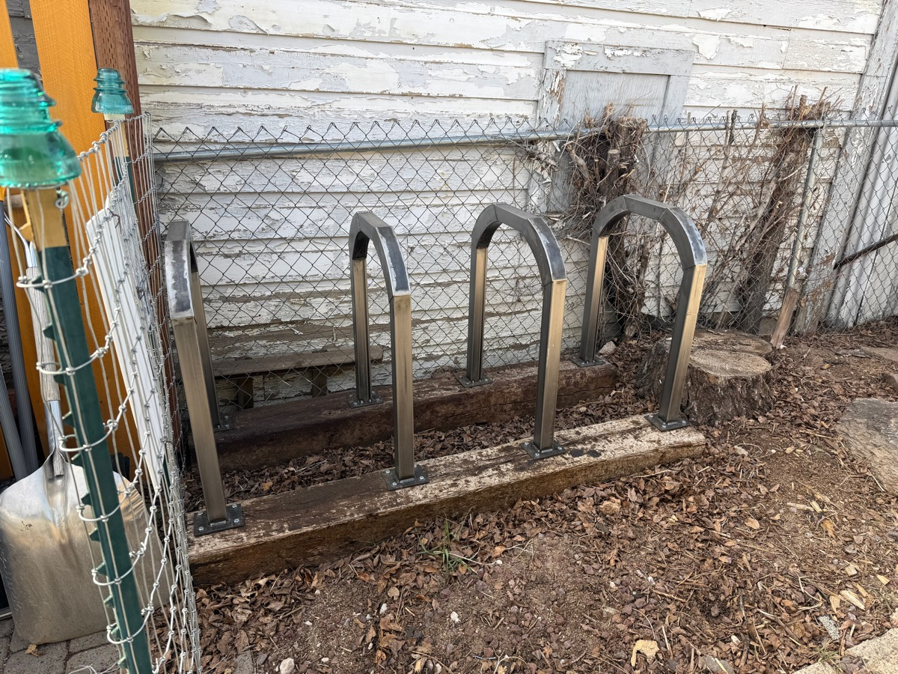
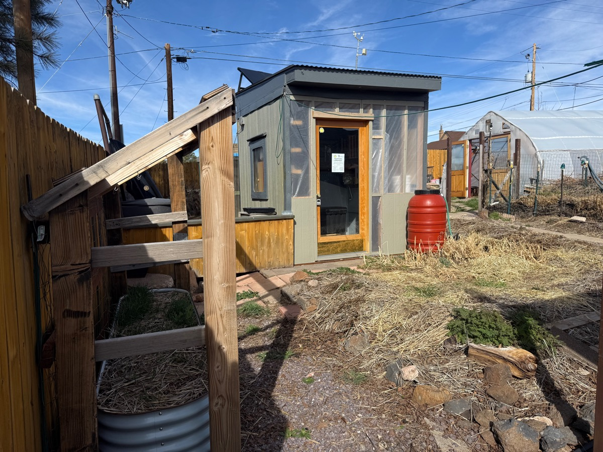

We recently completed a series of improvements to make Townsite Urban Farm more welcoming and accessible to everyone in our community.

The centerpiece of this work is a new formal entrance with a paved path, making it easier for visitors and volunteers of all ability levels to access the farm.
We also installed bike racks at the entrance to encourage sustainable transportation.

Alongside the entryway, we renovated an existing on-site shed — stabilizing the structure and replacing the roof — transforming it into a tool lending library and learning space in partnership with Flagstaff Foodlink.
This reuse of an existing structure was a more sustainable choice than demolishing it to build something new, and the library is now fully operational.

A new message board at the entrance links visitors to this website, making it easier to stay connected with what's happening at TUF.

These improvements deepen our partnerships and strengthen TUF's role as a community hub for sustainable food systems and climate resilience in Flagstaff.
